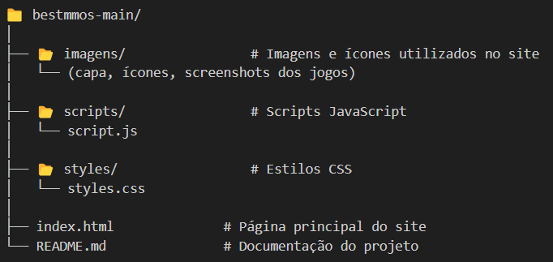

# 🧙‍♂️ BestMMORPGs - Projeto Lading page ⚔️

Este é um projeto de landing page, desenvolvido com o objetivo de informar os internautas sobre os melhores jogos do gênero MMORPG e auxiliá-los na escolha de qual jogo vale mais a pena investir tempo e interatividade.

# ✅Funcionalidades

🎮 Catálogo de MMORPGs:

O site apresenta uma seleção dos MMORPGs mais populares de 2024, incluindo.

📊 Tabela Comparativa:

Uma tabela detalha as vantagens e desvantagens de cada jogo, abordando aspectos como: otimização para PCs modestos, Modelo de monetização (gratuito ou pago), entre outros.

🗳️ Formulário de Votação:

Ao final da página, há um formulário que convida os visitantes a votar em qual MMORPG pretendem jogar em 2025. As opções incluem os jogos listados anteriormente. Embora o formulário esteja presente, não há indicação de que os votos sejam armazenados ou processados, sugerindo uma implementação básica.

🌐 Links para Sites Oficiais:

Cada jogo listado possui um link que direciona o usuário para seu site oficial, permitindo que obtenham mais informações diretamente da fonte.

# 🛠️ Tecnologias Utilizadas

•  HTML5 – Estrutura semântica do site

•  CSS3 – Estilização visual responsiva

•  JavaScript – Interatividade, incluindo o modal e outras ações

•  Figma – Prototipagem e edição de ícones/gráficos

•	Media Queries: Usadas para adaptar o layout em diferentes resoluções de tela.

# 📁 Estrutura do Projeto

# 👥 Autores

O projeto foi desenvolvido por Álex Robert e Luiz Felipe Alves de Sena, sob orientação do Professor Alex Cabral, durante a disciplina de Linguagem de Marcação, como pré-requisito para obtenção da 3º nota.